# py_m_map — Examples

Python port of Rich Pawlowicz's [M_Map](https://www-old.eoas.ubc.ca/~rich/map.html) MATLAB toolbox.
Each example below reproduces the corresponding M_Map gallery figure using the `py_m_map` API.

Running the suite writes freshly rendered figures to `tests/outputs/`, which is not
tracked by git. The images shown below are therefore the committed reference copies
in `tests/baseline/` — the same figures, and the ones the test suite compares each
run against.

---

## Basic Examples

### Example 1 — Orthographic Globe (Py_M_Map logo)

```python
m_proj('ortho', lat=48, lon=-123)
m_coast('patch', 'r')
m_grid(linestyle='-', xticklabels=False, yticklabels=False)
```

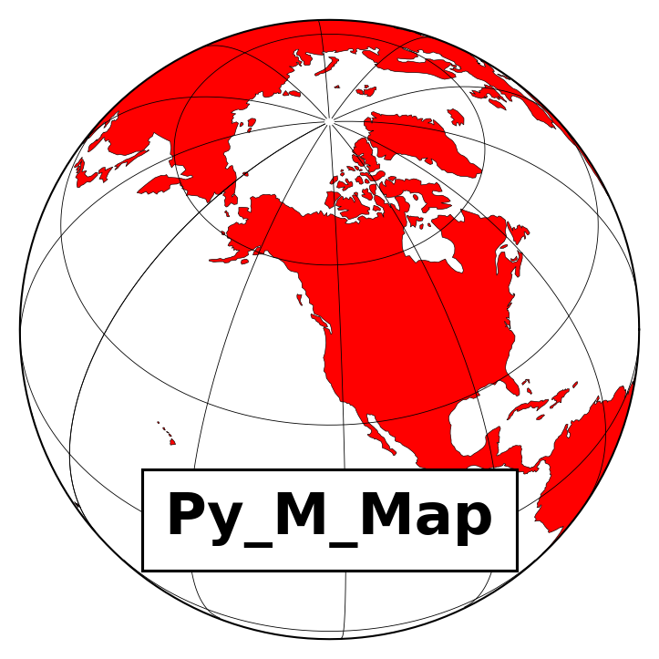

---

### Example 2 — Lambert Conformal Conic: North American Topography

Filled elevation contours on a conic projection of North America using the
built-in 1° ETOPO terrain database (`m_elev`).

```python
m_proj('lambert', lon=[-160, -40], lat=[30, 80])
m_coast('patch', [1, 0.85, 0.7])
m_elev('contourf', np.arange(500, 6001, 500), cmap='copper_r')
m_grid(box='fancy', tickdir='in')
```

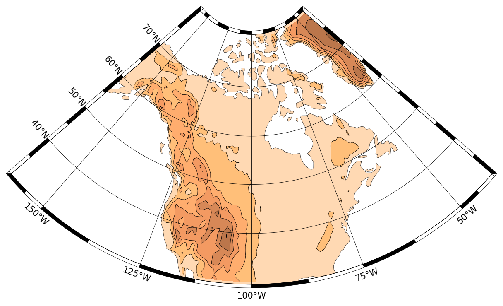

---

### Example 3 — Polar Stereographic: North Polar Region

Coastline drawn *after* the grid so it sits on top — as described in the
original M_Map documentation.

```python
m_proj('stereographic', lat=90, lon=30, radius=25)
m_elev('contour', np.arange(-3500, -499, 1000), edgecolor='b')
m_grid(xtick=30, tickdir='out', ytick=[70, 80], linest='-')
m_coast('patch', [0.7, 0.7, 0.7], edgecolor='r')
```

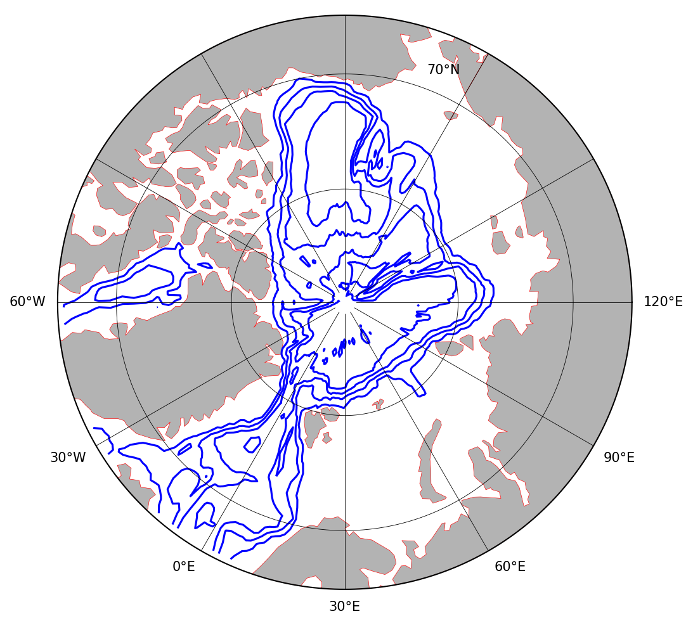

---

### Example 4 — Interrupted Sinusoidal and Mollweide Projections

Each lobe is a separate `m_proj` call that shares the same axes.
Antimeridian-crossing lobes (e.g. `lon=[145, 295]`) are handled automatically.

```python
# Subplot 1 — interrupted sinusoidal (7 lobes)
for lons, lats in zip(slongs, slats):
    m_proj('sinusoidal', lon=lons, lat=lats)
    m_grid(fontsize=6, xticklabels=[], yticklabels=[], linest='-', color=[0.7, 0.7, 0.7])
    m_coast('patch', 'g')

# Subplot 2 — interrupted Mollweide (6 lobes)
for lons, lats in zip(mlongs, mlats):
    m_proj('mollweide', lon=lons, lat=lats)
    m_grid(fontsize=6, xticklabels=[], yticklabels=[], linest='-', color='k')
    m_coast('patch', [0.6, 0.6, 0.6])
```

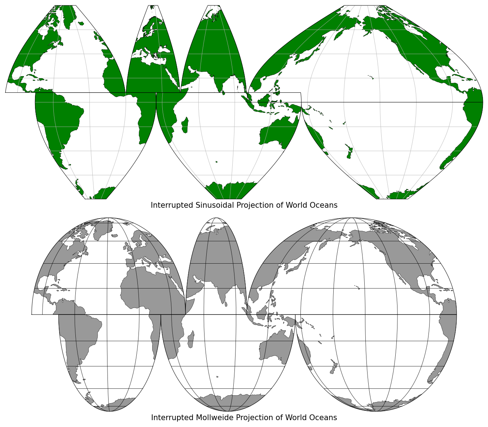

---

### Example 5 — Oblique Mercator: Quiver and Contour

Two-panel plot with shared oblique Mercator projection; left panel shows `m_quiver`
surface wind vectors, right panel shows `m_contour` wind speed with `clabel`.

```python
m_proj('oblique', lat=[56, 30], lon=[-132, -120], aspect=0.8)

# Left: quiver
m_coast('patch', [0.9, 0.9, 0.9], edgecolor='none')
m_grid(tickdir='out', yaxislocation='right', xaxislocation='top', ticklen=0.02)
m_quiver(lon, lat, u, v)

# Right: contour
m_coast('patch', [0.9, 0.9, 0.9], edgecolor='none')
m_grid(tickdir='out', yticklabels=[], xticklabels=[], linestyle='none', ticklen=0.02)
cs = m_contour(lon, lat, speed)
plt.clabel(cs, fontsize=8)
```

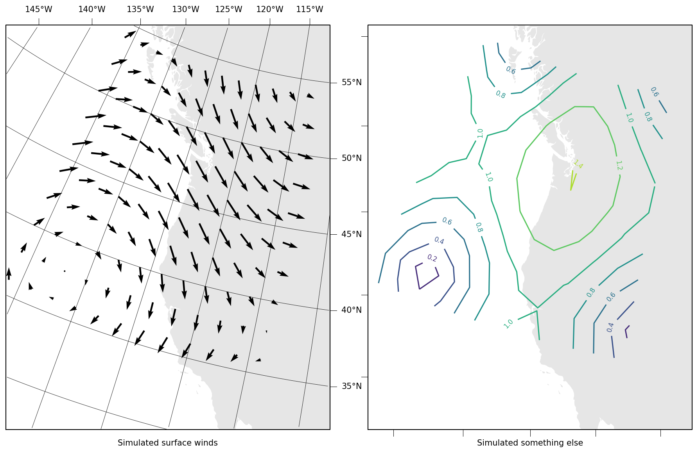

---

### Example 6 — Miller Cylindrical: Circular Orbit Track

A great-circle satellite ground track plotted with `m_line`; fancy box border
and a type-4 north arrow via `m_northarrow`.

```python
m_proj('miller', lat=82)
m_coast('line', color=[0, 0.6, 0])
m_line(lon, lat, linewidth=3, color='r')
m_grid(linestyle='none', box='fancy', boxstyle='line', tickdir='out')
m_northarrow(-150, 0, 40, type=4, linewi=0.5)
```

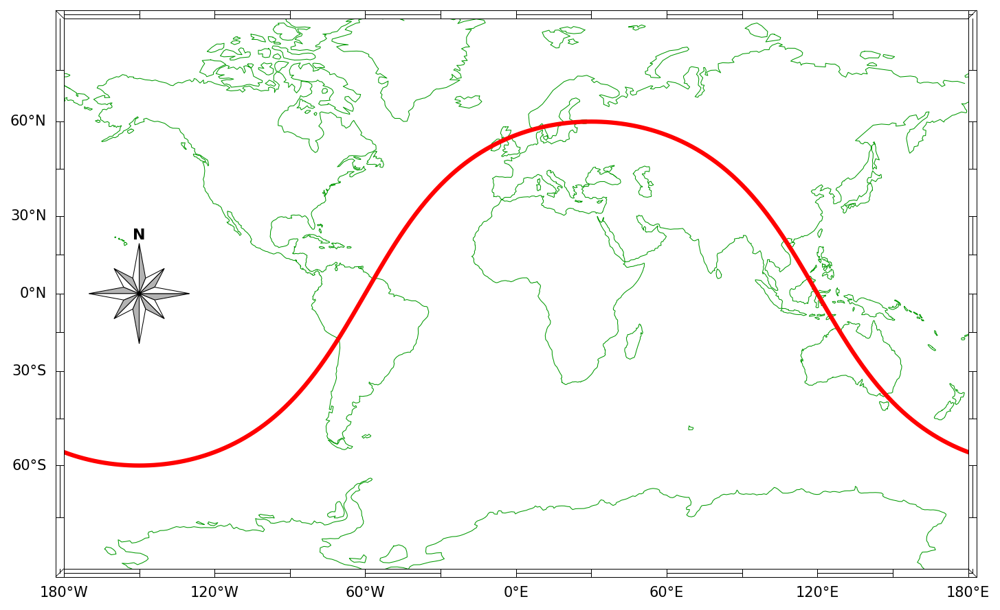

---

### Example 7 — Lambert Conic: European Topography with Colourbar

Combined ocean (blues) + land (gland) colourmap with `brighten` correction and
a floating colourbar via `m_contfbar`.

```python
m_proj('lambert', lon=[-10, 20], lat=[33, 48])
m_etopo2('contourf', levels, edgecolor='none', cmap=cmap, norm=norm)
m_grid(linestyle='none', tickdir='out', linewidth=3)
cbar_ax, cb = m_contfbar(1.12, [.5, .8], levels, levels, colormap=cmap)
```

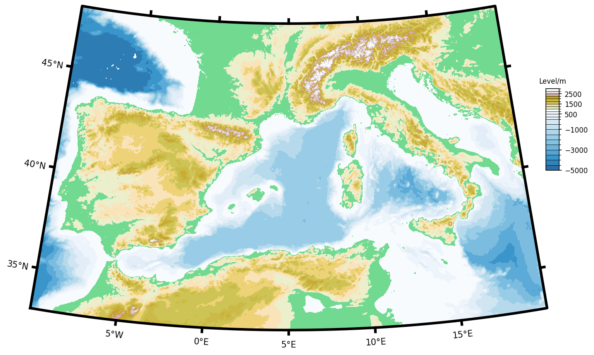

---

### Example 8 — Fancy Vectors (`m_vec`)

Demonstrates the full range of `m_vec` options: centred bars with no head,
directional arrows, colour-mapped arrows, curvature, edge clipping, and key
(legend) arrows.

```python
m_proj('orthographic', lon=-123, lat=48, radius=10)
m_coast('patch', facecolor=[0.9, 0.95, 0.9], edgecolor='none')
m_grid(linestyle=':', xtick=np.arange(-135, -109, 5), linewidth=2)

m_vec(100, [-133, -133], [49, 49], [0, 50], [100, 0], [0.7, 0.8, 0.9],
      centered='yes', shaftwidth=5, headlength=0, edgecolor='k')
m_vec(100, vlon, vlat, uu, vv, 'm', shaftwidth=0.2, headlength=2.5, curvature=30)
m_vec(100, [-115], [38], [50], [0], 'b', key='50 cm s$^{-1}$')
```

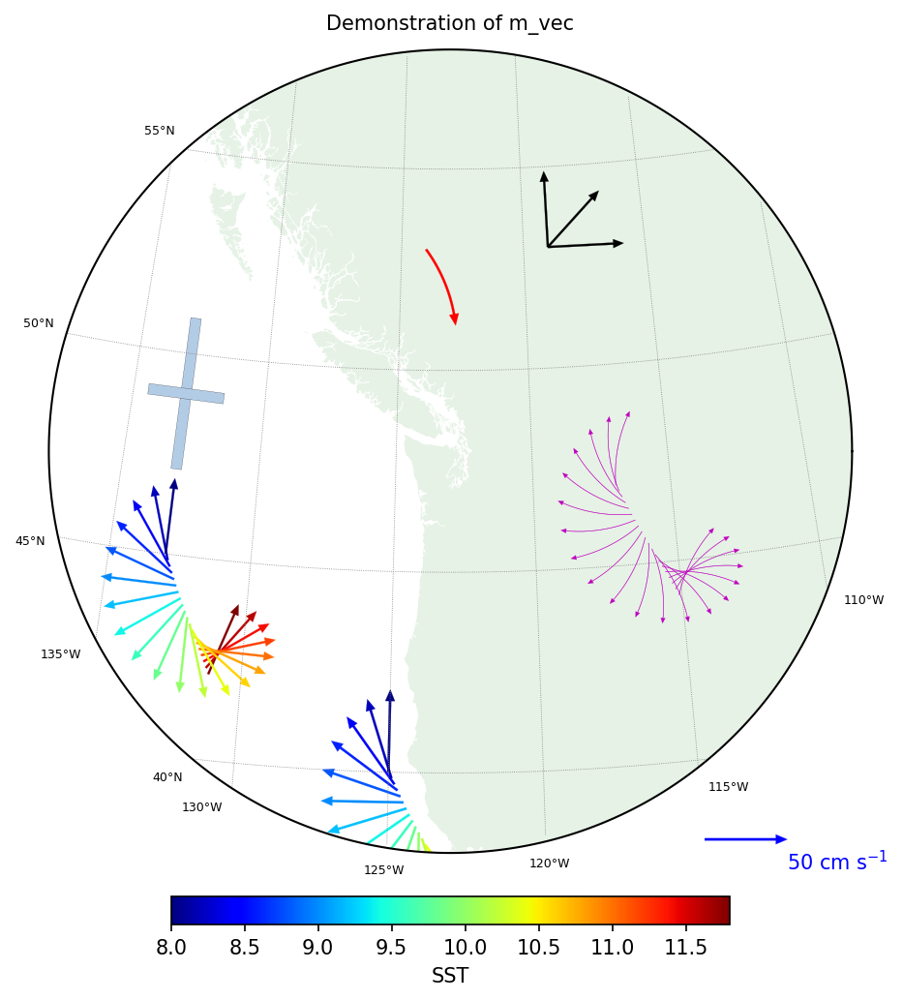

---

### Example 9 — GSHHS Coastlines at Multiple Scales

Six-panel zoom sequence from continental (Natural Earth 110 m) to full
resolution (GSHHS `f`, ~40 m), centred on Nova Scotia.

```python
mm.m_proj('albers', lon=[-90, -50], lat=[40, 60])
mm.m_coast('patch', [0, 1, 0])              # Natural Earth (auto)

mm.m_proj('albers', lon=[-80, -55], lat=[40, 54])
mm.m_gshhs_c('patch', [0.2, 0.8, 0.2])     # GSHHS crude

mm.m_proj('albers', lon=[-67, -58], lat=[43, 48])
mm.m_gshhs_l('patch', [0.4, 0.6, 0.4])     # GSHHS low

# … and so on through m_gshhs_i, m_gshhs_h, m_gshhs_f
mm.m_ruler([0.30, 0.70], 0.90, nbar=4, fontsize=6)
```

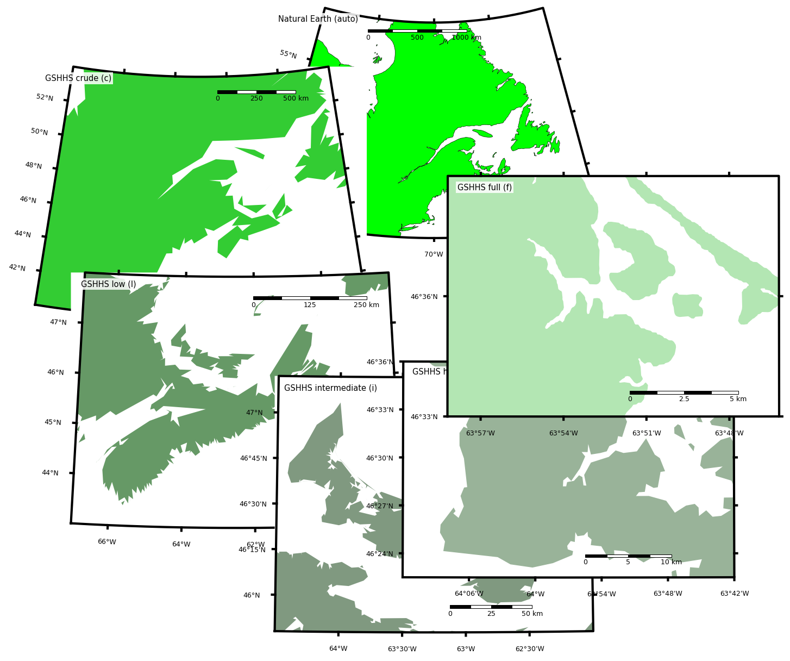

---

### Example 10 — UTM Grid with Ship Track

GSHHS intermediate coastlines on a UTM projection; animated ship-track
annotations (time labels, perpendicular ticks) via `m_track`.

```python
mm.m_proj('utm', lon=[-72, -68], lat=[40, 44])
mm.m_gshhs_i('line', color='k')
mm.m_grid(box='fancy', tickdir='in', fontsize=6, xtick=1, ytick=1)
mm.m_ruler([0.55, 0.90], 0.15, nbar=4, fontsize=7)
mm.m_track(lons, lats, navtimes, ticks=0, times=4, dates=8,
           clip='off', color='r', orient='upright', fontsize=6)
mm.m_northarrow(-68.5, 43.4, 0.4, type=2)
```

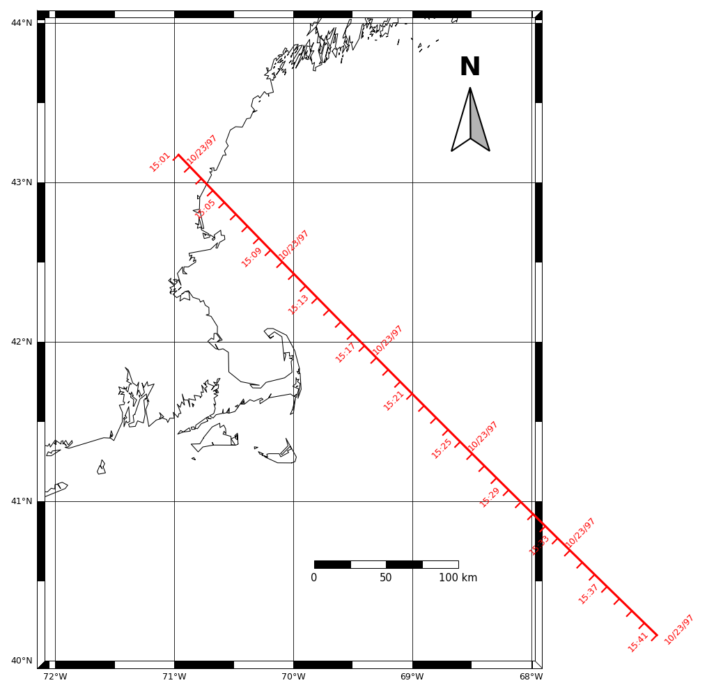

---

### Example 11 — Hammer Projection: Range Rings from Bangkok

Great-circle range rings at 1 000 km intervals, centred on Bangkok (100.5°E,
13.5°N), using `m_range_ring`.

```python
mm.m_proj('hammer', lon=170, lat=[-90, 90])
mm.m_coast('patch', color=[0, 0.6, 0])
mm.m_grid(grid='off')
mm.m_line(100.5, 13.5, marker='s', color='r', linestyle='none')
mm.m_range_ring(100.5, 13.5, np.arange(1000, 16000, 1000), color='b')
```

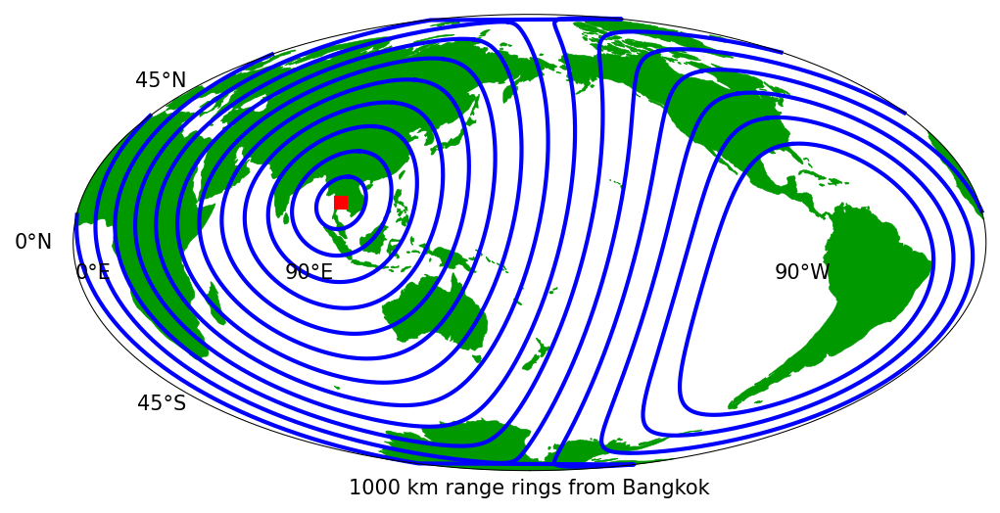

---

### Example 12 — Lambert Conic: BC Coast with Speckle and Hatch

GSHHS intermediate coastline rendered with both line and speckle styles;
a boundary polygon with diagonal hatch fill via `m_hatch`.

```python
mm.m_proj('lambert', lon=[-130, -121.5], lat=[47, 51])
mm.m_gshhs_i('line', color='k')
mm.m_gshhs_i('speckle', color='k')
mm.m_line(BNDRY_LON, BNDRY_LAT, linewidth=2, color='k')
mm.m_hatch(BNDRY_LON, BNDRY_LAT, 'single', 30, 5, color='k')
mm.m_grid(linewidth=2, linestyle='none')
mm.m_text(-128, 48, ['Pacific', 'Ocean'], fontsize=18)
mm.m_northarrow(-122.5, 50.2, 0.8, type=3, linewi=2)
```

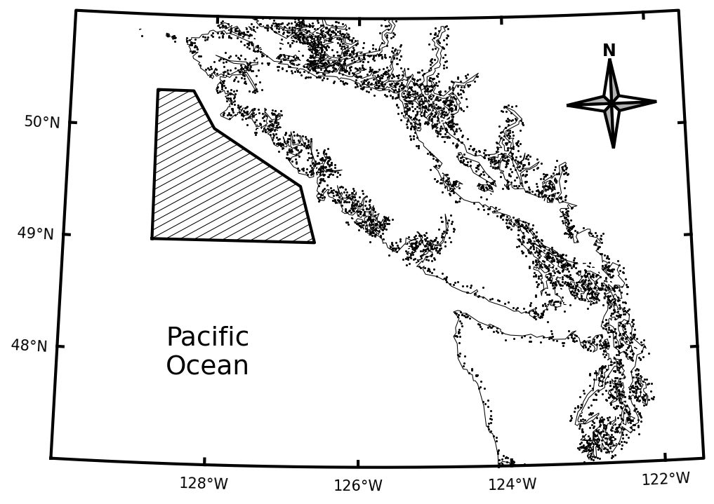

---

### Example 13 — Blue Ocean: Great-Circle Routes

Miller cylindrical projection with a coloured ocean background; three
great-circle routes from Vancouver to Cairo, Washington, and Buenos Aires
computed with `m_lldist` and labelled with distances.

```python
mm.m_proj('miller', lat=[-77, 77])
mm.m_coast('patch', color=[0.7, 1.0, 0.7], edgecolor='none')
mm.m_grid(box='fancy', linestyle='-', gridcolor='w', backcolor=[0.2, 0.65, 1.0])

for k in range(3):
    dist, ln, lt = mm.m_lldist([van_lon, lons[k]], [van_lat, lats[k]], 40)
    mm.m_line(ln[0], lt[0], color='r', linewidth=2)
    mm.m_text(ln[0, -1], lt[0, -1], f'{cities[k]} — {round(dist[0])} km')
```

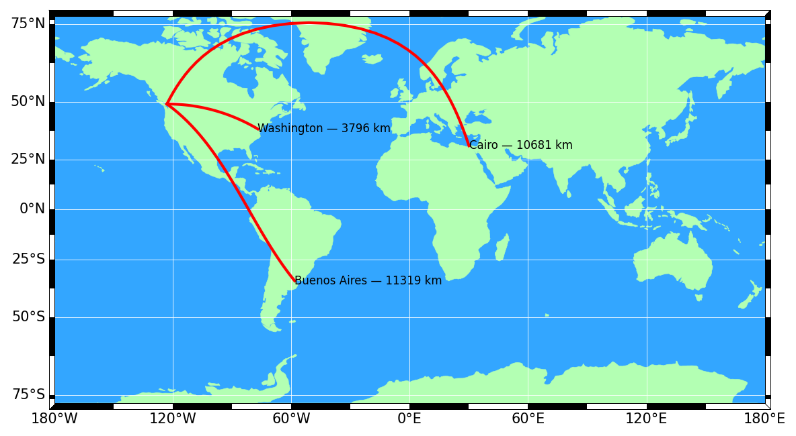

---

### Example 14 — One Ocean: Multiple Elevation Display Modes

Four-panel Lambert Azimuthal Equal-Area view of the Southern Ocean with the
same combined blues + gland colourmap rendered four ways.

```python
mm.m_proj('azimuthal equal-area', lon=-95, lat=-46, radius=156)

# Panel A: coast patch only
mm.m_coast('patch', facecolor=[0.85, 0.3, 0.3])

# Panel B: m_elev contourf
mm.m_elev('contourf', cmap=cmap_combined, vmin=-7000, vmax=5000)

# Panel C: m_elev image
mm.m_elev('image', cmap=cmap_combined, vmin=-7000, vmax=5000)

# Panel D: m_elev shadedrelief
mm.m_elev('shadedrelief', colormap=cmap_blues)
```

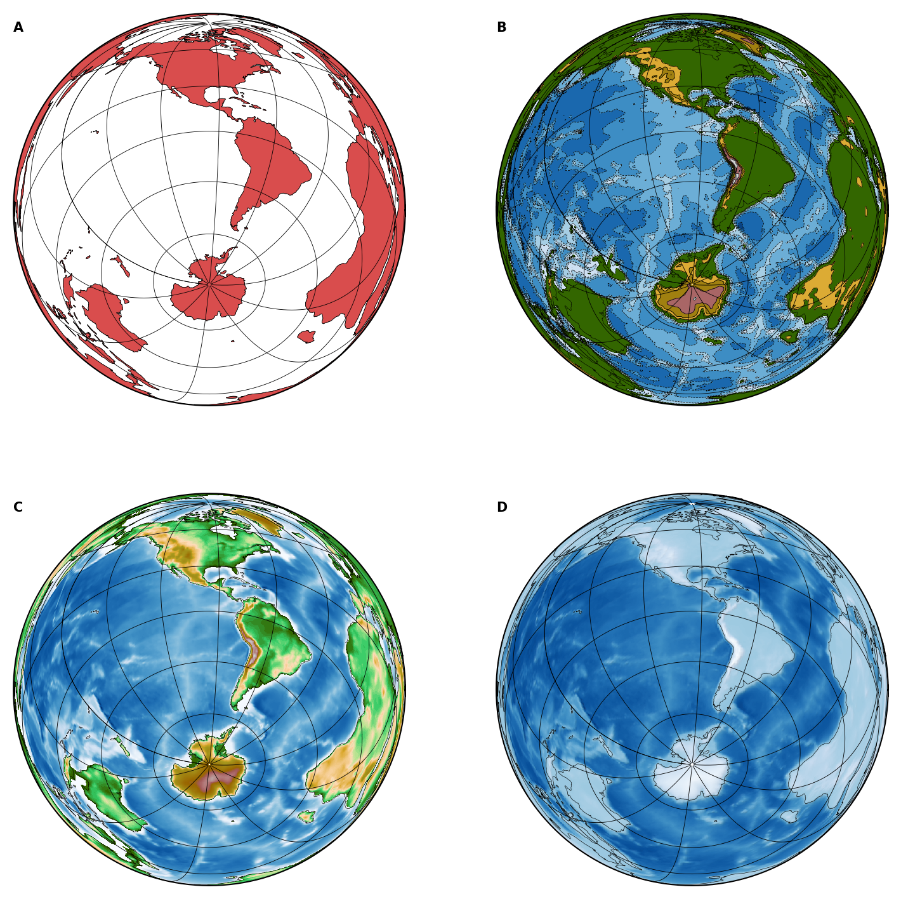

---

### Example 15 — Stepped Jet Colourmap with `m_pcolor`

Global TEOS-10 Absolute Salinity Anomaly at 3 000 dbar on a Pacific-centred
Robinson projection, coloured with a stepped (discretised) jet colourmap.

```python
mm.m_proj('robinson', lon=[-330, 30], lat=[-90, 90])
h = mm.m_pcolor(lon_data, lat_data, data)
mm.m_coast('patch', color=[0.7, 0.7, 0.7], edgecolor='none')
mm.m_grid(tickdir='out', linewidth=2)
h.set_cmap(mm.m_colmap('jet', 'step'))
```

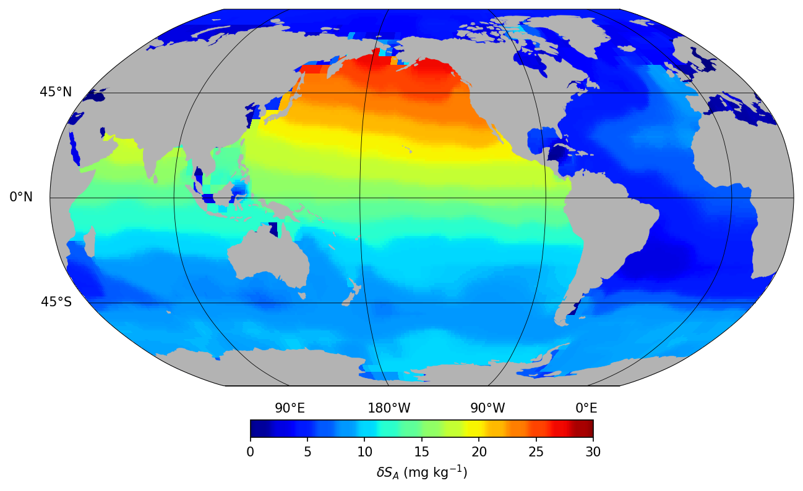

---

### Example 16 — NE Pacific Bathymetry

Lambert conic projection with ETOPO1 filled contours, GSHHS intermediate
coastlines, Line P station markers, Juan de Fuca Ridge vent markers, and a
floating horizontal colourbar.

```python
mm.m_proj('lambert', lon=[-155, -117], lat=[33, 62])
mm.m_etopo2('contourf', levels, edgecolor='none', cmap=cmap, vmin=-6000, vmax=0)
mm.m_gshhs_i('patch', facecolor=[0.75, 0.75, 0.75])
mm.m_line(_LINEP_LON, _LINEP_LAT, marker='o', color='r', linestyle='none')
mm.m_line(_VENT_LON, _VENT_LAT, marker='s', color='g', linestyle='none')
mm.m_grid(box='fancy', boxstyle='line', tickdir='out')
cbar_ax, cb = mm.m_contfbar([0.475, 0.725], 0.82, ...)
```

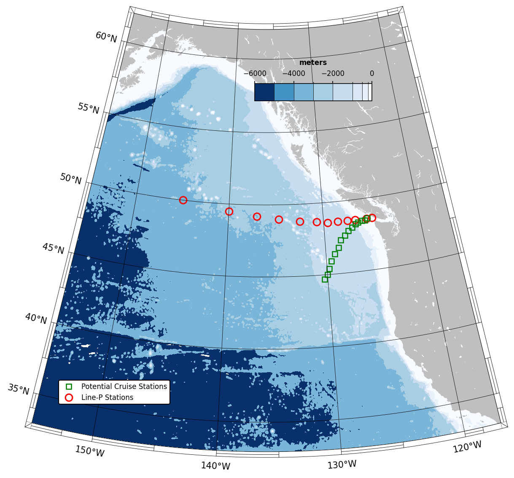

---

### Example 17 — South China Sea Shaded Relief

Mercator projection with ETOPO1 shaded relief, GSHHS high-resolution
coastlines, and a vertical depth colourbar using the custom `depth` colourmap.

```python
mm.m_proj('mercator', lon=[105, 124], lat=[5, 24])
mm.m_etopo2('shadedrelief', colormap=depth_cmap, caxis=(-6000, 0))
mm.m_gshhs_h('patch', facecolor=[0.70, 0.70, 0.70])
mm.m_grid(linestyle='-', tickdir='out', box='fancy')
cbar_ax, cb = mm.m_contfbar(1.08, [0.15, 0.90], ...)
```

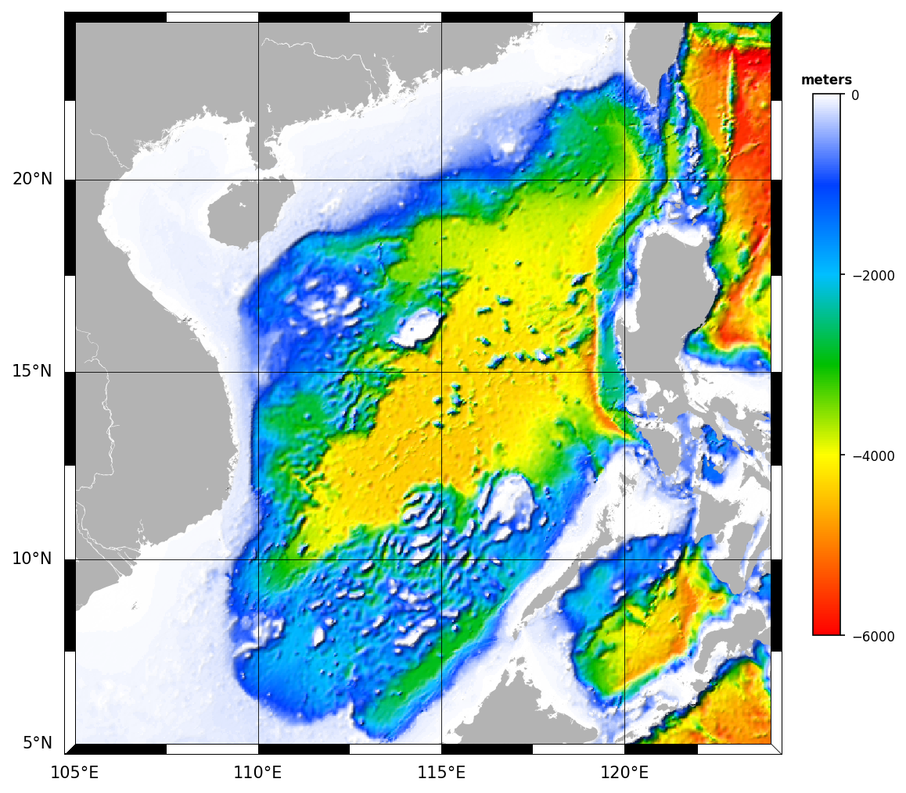

---

### Example 18 — Vancouver Harbour Shaded Relief with UTM Grid

Two-panel UTM projection of Vancouver Harbour; bathymetric shaded relief
from NONNA10 survey data (left) and from the seamless GDB DEM (right),
with depth contour labels, NHN river centrelines, UTM grid, scale bar,
and north arrow.

```python
mm.m_proj('utm', lat=_LAT_LIM, lon=_LON_LIM)
mm.m_shadedrelief(lon_vec, lat_vec, Z, coords='geog',
                  light_angle=-45, gradient=8, colormap=blues_rgb)
mm.m_gshhs_f('patch', col, edgecolor='k')
mm.m_grid(tickdir='out', linestyle='none', xaxislocation='top', yaxislocation='right')
mm.m_utmgrid(color='b', linestyle='-')
mm.m_ruler([0.5, 0.78], 0.9)
mm.m_northarrow(lon, lat, scale, type=4, aspect=1.5)
```

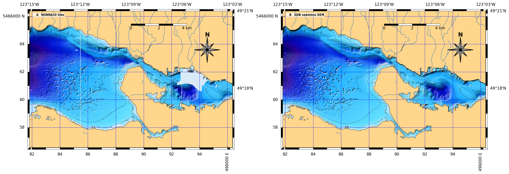

---

### Example 19 — Wind Roses: Strait of Georgia

Oblique Mercator projection of the Strait of Georgia with `m_windrose` fan
diagrams colour-coded by wind speed, and a vertical speed colourbar.

```python
mm.m_proj('oblique', lon=[-125.3, -122.6], lat=[50.1, 48.6], aspect=0.45)
mm.m_coast('patch', color=[0.85, 0.85, 0.85])
pcs = mm.m_windrose(STATIONS_LON, STATIONS_LAT, thets_list, spds_list,
                    nspeeds=levels, ndirs=16, size=0.17, alpha=1.0)
for pc in pcs:
    pc.set_cmap(mm.m_colmap('jet'))
    pc.set_clim(0, 24)
mm.m_grid(tickdir='out', linestyle='none')
cbar_ax, cb = mm.m_contfbar(1.07, [0.1, 0.9], levels, levels, colormap=cmap)
```

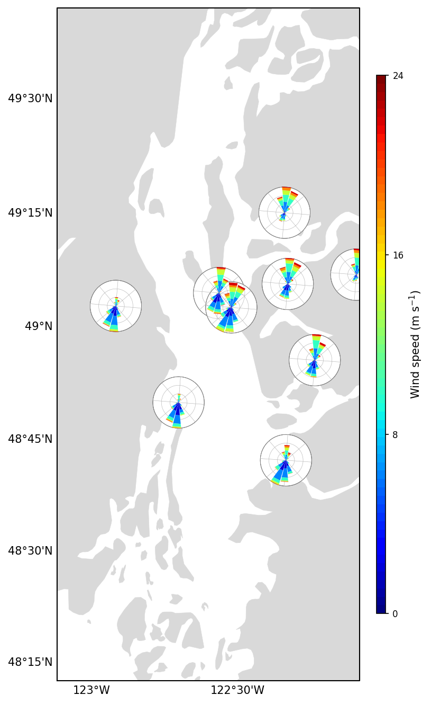

---

### Example 20 — Colourmap Gallery

All `m_colmap` named colormaps displayed side by side, including composite
(blues + gland) and derived (ODV with cosine shading, stepped jet) variants.

```python
cmap = mm.m_colmap('name', n_colours)           # standard
cmap = mm.m_colmap('jet', 'step')               # banded / stepped
cmap = mm.m_colmap('jet', n, ncol)              # n discrete colours
```

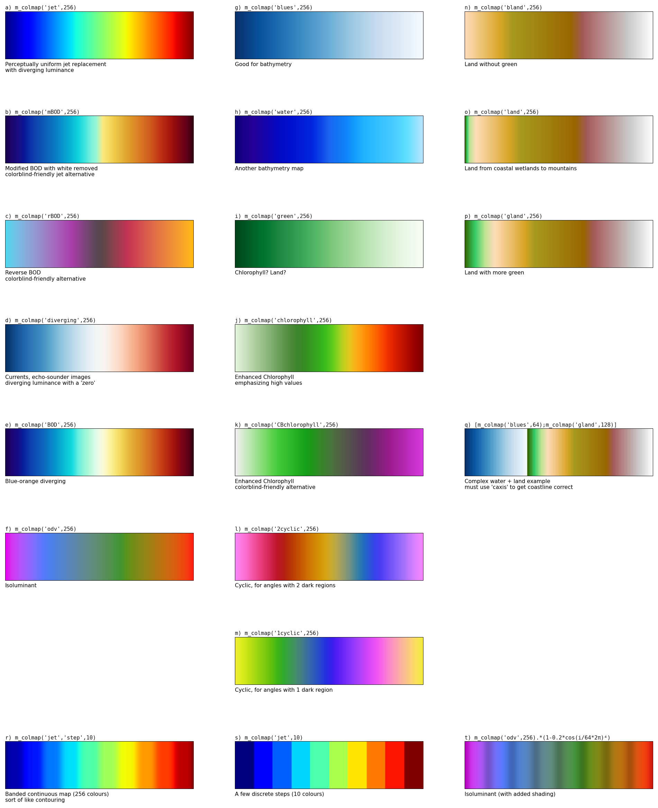

---

## Satellite Data Examples

These use **real data**, downloaded from NOAA PSL on first run and cached in
`~/.py_m_map/` — see `tests/example_data.py` for the registry and provenance. All
sources are open and need no authentication. The two 64 MB OISST files are opt-in:
run once with `PY_M_MAP_FETCH_LARGE=1` to fetch them, and any example needing data
it cannot reach skips with an explanatory message rather than failing.

Where m_map's originals read HDF files that are no longer publicly retrievable,
the equivalent open product is substituted. Two of m_map's satellite examples have
no open counterpart and were dropped rather than faked (see the note at the end of
this section).

### Satellite Example 1 — Global SST, Hammer-Aitoff Projection

November 1999 monthly-mean sea-surface temperature on a Pacific-centred
Hammer-Aitoff, via `m_pcolor` — the same month the original mapped from the
Pathfinder AVHRR product, here from NOAA OI SST V2 at 1°.

```python
mm.m_proj('hammer-aitoff', lon=-150, lat=[-90, 90])   # Pacific-centred
mm.m_pcolor(lon_g, lat_g, sst, cmap='RdYlBu_r', vmin=-2, vmax=30)
mm.m_coast('patch', color=[0.6, 1, 0.6])
mm.m_grid(xaxislocation='middle')
```

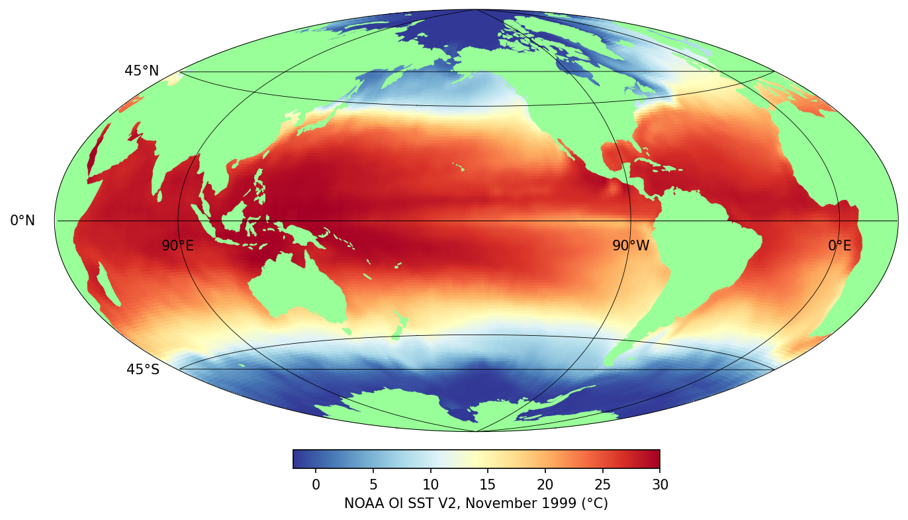

---

### Satellite Example 2 — Arctic Sea-Ice, Azimuthal Equal-Area

Sea-ice concentration for September 2012 — the record Arctic minimum — on a polar
azimuthal equal-area cap. Open water is masked out so it reads as background
rather than as the lowest colour of the ramp.

```python
mm.m_proj('azimuthal equal-area', lat=90, lon=0, radius=47)
conc = np.where(conc > 0.5, conc, np.nan)          # drop open water
mm.m_pcolor(lon_g, lat_g, conc, cmap=ice_cmap, vmin=0, vmax=100)
mm.m_coast('patch', color=[0.2, 0.5, 0.2], edgecolor='k')
mm.m_grid(tickdir='out', linewidth=1.0)
```

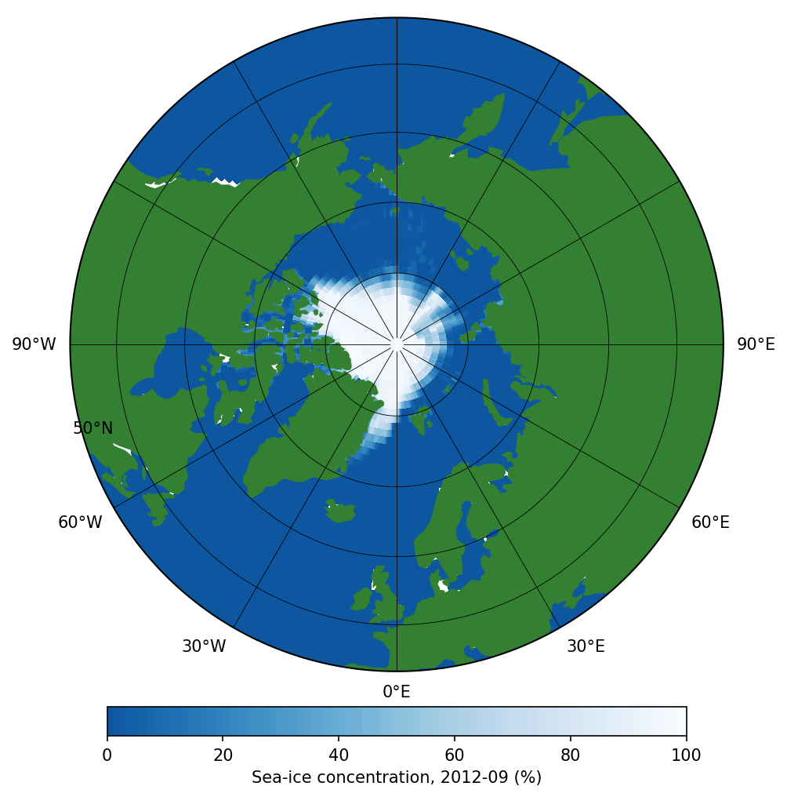

---

### Satellite Example 4 — NE Pacific SST Anomaly ("the Blob")

January 2015 SST anomaly against the 1982–2011 January mean, on a Lambert conic —
the 2013–2015 NE Pacific marine heatwave. Shows a diverging colormap centred on
zero and `m_contfbar` over discrete bands, in contrast to example 1's continuous
global field.

```python
mm.m_proj('lambert', lon=[-160, -120], lat=[32, 60])
mm.m_contourf(lon_g, lat_g, anomaly, np.arange(-3, 3.01, 0.5),
              cmap='RdBu_r', edgecolor='none', extend='both')
mm.m_coast('patch', color=[0.75, 0.75, 0.72], edgecolor='k')
mm.m_grid(box='fancy', tickdir='out')
cbar_ax, _ = mm.m_contfbar([0.25, 0.75], -0.10, anomaly, levels)
```

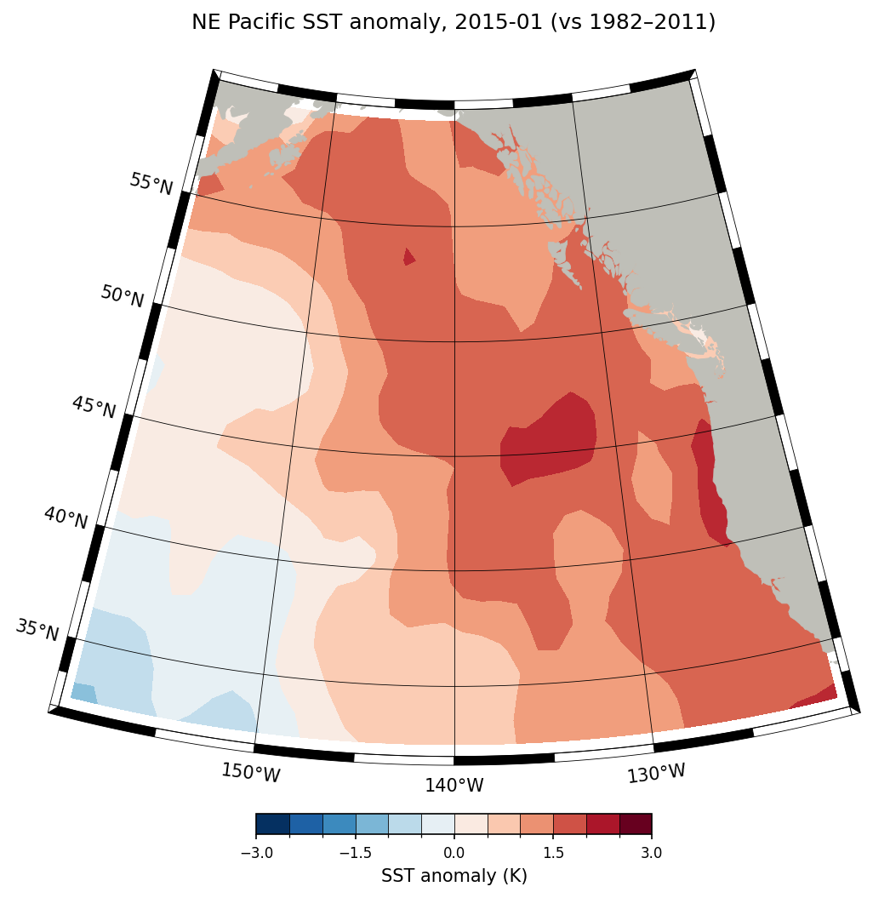

---

### Satellite Example 5 — NCEP Reanalysis: North Pacific Winds and Precipitation

Miller cylindrical projection with NCEP/NCAR Reanalysis January mean
precipitation (filled contours) and 10 m wind barbs (`m_windbarb`).
Uses real NCEP LTM netCDF files.

```python
mm.m_proj('miller', lon=[100, 260], lat=[0, 65])
mm.m_coast('patch', [0.8, 0.8, 0.8])
cs = mm.m_contourf(LN, LT, prate_scaled, np.arange(0.05, 0.71, 0.05), edgecolor='none')
mm.m_windbarb(LN, LT, u_ms, v_ms, scale=2, units='m/s', color='r')
mm.m_grid(box='fancy', tickdir='out')
cbar_ax, cb = mm.m_contfbar([0.3, 0.7], 0.05, cs, cs)
```

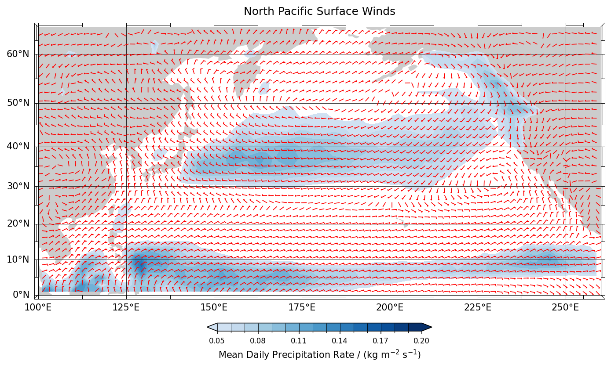

---

### Satellite Example 6 — ARGO Drifter Tracks, NE Pacific

Lambert conformal conic projection with ETOPO1 bathymetry, GSHHS coastlines,
and ARGO float tracks rendered with `m_line` and displacement vectors via
`m_vec`; geodesic computations use `m_idist` and `m_fdist`.
(*Reference uses real ARGO netCDF; shown here with synthetic float tracks.*)

```python
mm.m_proj('lambert', lon=[-150, -124], lat=[40, 60])
mm.m_etopo2('contourf', np.arange(-7000, 1, 500), edgecolor='none')
mm.m_gshhs_l('patch', [0.5, 0.8, 0], edgecolor='none')
for flt in floats:
    mm.m_line(flt['lon'], flt['lat'], color='k')
    mm.m_vec(vecscl, mid_lon, mid_lat, dx, dy, 'r', shaftwidth=2)
```

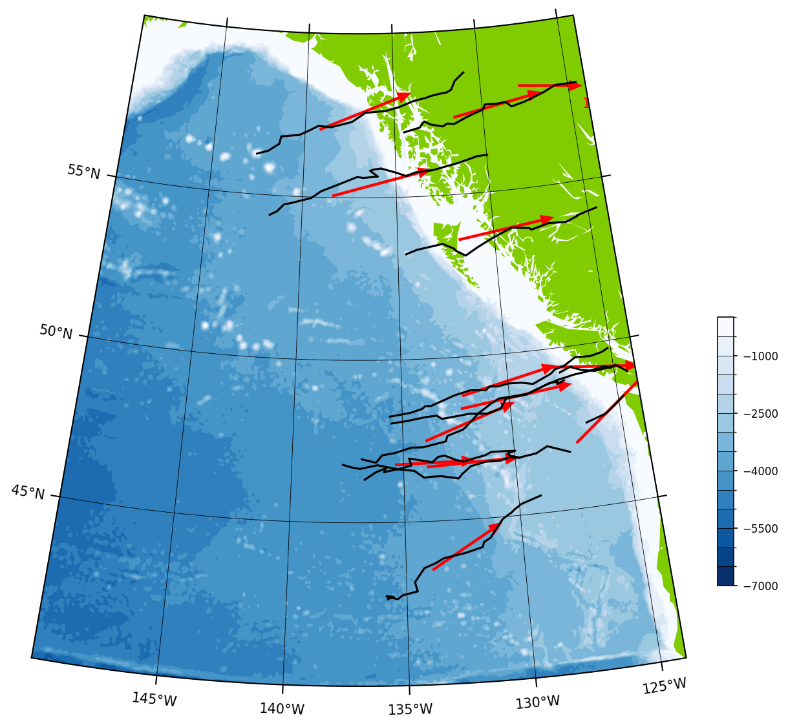

---

### Dropped: m_map satellite examples 3 and 7

m_map's satellite example 3 (a georeferenced aerial photograph on a UTM grid) and
example 7 (an ERS-1 SAR amplitude image of internal waves in the Strait of
Georgia) both depended on specific image files that are no longer publicly
retrievable, and no open substitute exists for either.

They previously stood in with synthetic images — three flat coloured rectangles
and a field of grey noise respectively — which demonstrated nothing about the
library and misrepresented what the figures were meant to show. They have been
removed rather than left as placeholders.

The library features they exercised are still covered: `m_image` on a UTM grid
appears in example 18, and `m_pcolor` with a ruler-style fancy box in example 5.

---

### Satellite Example 8 — Barkley Sound: Shaded Relief and Filled Contours

Two-panel equidistant cylindrical projection of Barkley Sound using real
high-resolution bathymetry from `barkley_sound_1_navd88_2016.nc`.
Left: `m_contourf`; right: `m_shadedrelief`.

```python
mm.m_proj('equidistant', lon=clon, lat=clat)

# Left: filled contours
mm.m_contourf(lon, lat, Z, levels)
mm.m_grid(box='fancy', tickdir='out', grid='none', fontsize=14)
mm.m_contfbar([0.3, 0.7], 0.98, Z, levels, axfrac=0.02, endpiece=False)

# Right: shaded relief
mm.m_shadedrelief(lon, lat, Z, colormap=cmap)
mm.m_grid(box='fancy', grid='none', fontsize=14)
```

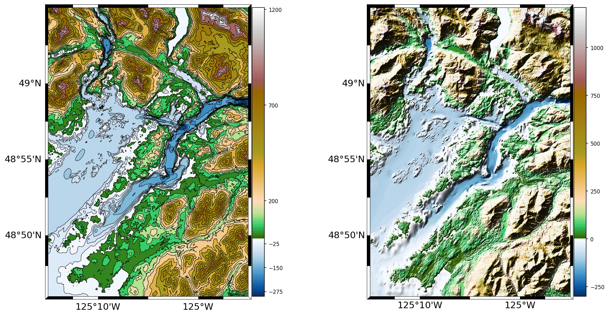
